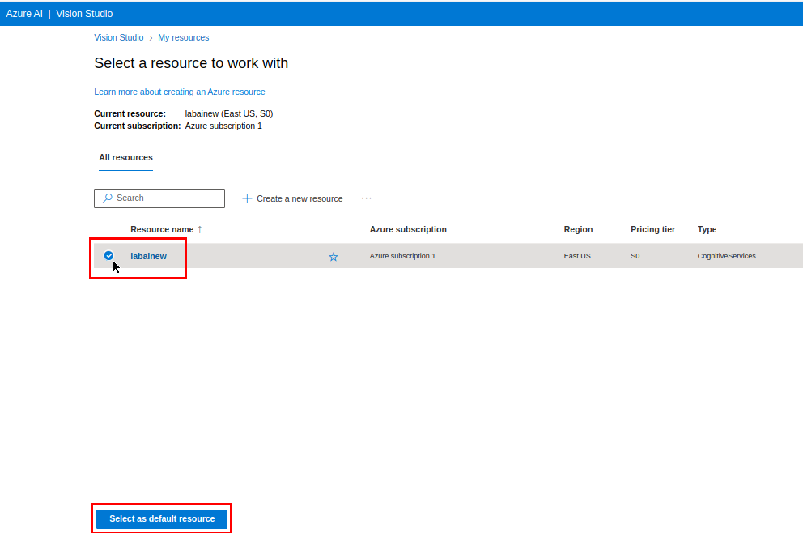

# Lab Project 02 - Análise de imagem 4.0 com AI Vision Service

-green)

-blue)

O objetivo desse laboratório é testar alguns recursos para detecção de faces, extração de textos e geração de legendas para imagens na plataforma Vision Studio da Azure. Esses procedimentos foram realizados como parte do **Bootcamp Microsoft Azure AI Fundamentals, da DIO**.

**Visão computacional** é uma das áreas em que a aplicação de **inteligência artificial** tem mais evoluído. A possibilidade de análise de um grande volume de imagens de forma automatizada é um exemplo, dentre vários, do que torna o uso de *machine learning* ideal para esse contexto. A **plataforma Vision Studio, da Azure** contempla diversos serviços de análise de imagens usando AI que podem ser integrados em forma de API REST a uma aplicação. Isso permite realizar tarefas repetitivas, que antes teriam que ser realizadas por humanos, ou nem mesmo seriam possíveis, por meio de um serviço do Vision Studio. Nesse laboratório, a fim de me familiarizar com as tecnologias disponíveis na plataforma, testei algumas dessas funcionalidade através de cinco desses serviços: **Detect Faces in an image**, **Extract text from images**, **Add captions to images**, **Extract common tags from images** e **Object detection**.  

## Índice
1. [Procedimento](#procedimento)
2. [Como esse repositório está organizado](#como-esse-repositório-está-organizado)
3. [Detect Faces](#detect-faces)
4. [Optical Character Recognition](#ocr---optical-character-recognition)
5. [Image Analysis](#image-analysis)
6. [Conclusão e Insights](#conclusão-e-insights)

## Procedimento
Esses experimentos foram baseados nos guias da Microsoft Learn. Para informações mais detalhadas, consulte-os nos links disponíveis abaixo:
- [Detect faces in Vision Studio](https://microsoftlearning.github.io/mslearn-ai-fundamentals/Instructions/Labs/04-face.html)
- [Read text in Vision Studio](https://microsoftlearning.github.io/mslearn-ai-fundamentals/Instructions/Labs/05-ocr.html)
- [Analyze images in Vision Studio](https://microsoftlearning.github.io/mslearn-ai-fundamentals/Instructions/Labs/03-image-analysis.html)

### Criar um recurso Azure AI Services
Para ser possível usar o Vision Studio, é essencial que você possua um workspace para a plataforma associado a sua conta Azure. Isso pode ser feito por meio dos seguintes passos:
1. Acessar https://portal.azure.com
2. Criar um novo recurso Azure AI Services através da opção Create Resource.
3. Esperar o *deploy* do recurso terminar.

    

### Conectar Azure AI Services ao Vision Studio
Com o recurso Azure AI Services criado, é preciso conecta-lo ao Vision Studio. Para isso, basta seguir os seguintes passos:

1. Acessar o [Vision Studio](https://portal.vision.cognitive.azure.com).
2. Na página inicial, acessar os recursos criados através do botão "View all resouces".

    

3. Selecione o recurso criado anteriormente e defina-o como *default*.

    

### Selecionando e testando um serviço do Vision Studio
Ao retornar a página inicial após concluídos os passos anteriores, é possível ver a lista de serviços disponíveis para teste na plataforma. Basta selecionar um e começar a testar. Cada serviço traz algumas imagens pré-definidas, mas é possível também fazer *upload* de seus próprios arquivos.

    

Cada serviço exibe também referências para a documentação, que mostra como realizar testes com código e como inserir o serviço em sua aplicação. 

## Como esse repositório está organizado
O experimentado foi separado em 3 conjuntos: Detect Faces, OCR e Image Analysis. Para cada um desses experimentos (que serão mostrados abaixo), existe uma pasta do repositório (detect-faces, extract-text e img-analysis, respectivamente) contendo os arquivos correspondentes. Cada uma dessas pastas possui duas subpastas:
- **inputs:** contém as imagens testadas. 
- **output:** contém arquivos de saída correspondentes a cada imagem da pasta input. O arquivo MARKDOWN exibe a saída em texto e o arquivo json exibe informações mais detalhadas do resultado, que geralmente incluem a confiança do resultado o *request id* da API, *bound-boxes*, entre outras. 

## Detect Faces
Detect Faces é uma solução que permite identificar faces humanas em imagens. O primeiro teste realizado foi algo simples, em teoria facilmente identificável devido às boas condições.

    

Eu tentei dificultar um pouco ao escolher uma imagem de uma criança e da mulher com o rosto levemente tampado pelo cabelo. Apesar disso, o modelo identificou corretamente as duas faces. 

A segunda imagem foi uma tentativa de dificultar um pouco mais para a IA. Selecionei uma imagem com sombras e em preto e branco. O modelo foi capaz de identificar o rosto e identificar certa oclusão na face, que é explicitada no arquivo JSON como "otherMaskOrOcclusion".

    

Por fim, a última tentativa foi usar algo mais abstrato. A figura, em preto e branco e com bastante ruído, representa uma arte em um prédio que contém um rosto humano, porém não realista. Nesse caso, a IA não foi capaz de identificar a face.

    

## OCR - Optical Character Recognition
OCR consiste em detectar e extrair texto de imagens. Para isso, nesse experimento eu utilizei a solução "Extract text from images". Novamente, o primeiro teste foi feito com uma situação real e teoricamente fácil de ser identificada, com texto na horizontal e com boa iluminação.

    

Como esperado, o modelo reconhece com precisão todo o texto escrito. Por isso, tentei dificultar novamente e colocar uma imagem com texto inclinado.

    

Mais uma vez, todo o texto foi extraído com precisão. Uma nova tentativa de complicar o reconhecimento foi usar uma imagem em preto e branco e com o texto em perspectiva, além de um letreiro com texto levemente estilizado. 

    

Aqui já vemos alguma dificuldade. O modelo reconhece bem o texto "Centro laboratorial", mas não foi capaz de reconhecer "IESTI", que está escrito de forma mais estilizada logo acima. Por fim, um último experimento foi usar a foto de um quadro negro de uma aula de física.

    

Aqui sim o modelo mostrou uma certa limitação. Apesar de reconhecer bem grande parte, houveram muitos erros principalmente onde há a ocorrência de frações ou de símbolos matemáticos. 

## Image Analysis
A aba de Image Analysis possui diversas ferramentas interessantes. Nesse experimento foram usadas três: **Add captions to images**, **Extract common tags from images** e **Object detection**.

### Add captions to images
A função desse serviço é gerar legendas, de apenas uma sentença, para as imagens fornecidas. Em ambos os testes o resultado foi bem satisfatório. Interessante notar que ele identificou a pessoa maior da primeira foto como uma mulher, mesmo ela estando de costas. Talvez isso tenha sido possível pelo estilo de vestimenta ou pela estrutura corporal. 

    

Na segunda imagem, a IA identificou o ônibus mesmo ele estando borrado devido ao seu movimento.

    

### Extract common tags from images
Esse serviço é capaz de extrair o contexto ou tags de uma imagem, com base em objetos reconhecíveis. 

    

    

### Object Detection
Object detection é capaz de identificar objetos e sua posição em uma imagem. Essa solução tende a funcionar muito bem em diversas imagens, como é possível notar na terceira imagem. Contudo, o modelo não foi capaz de reconhecer sequer um objeto nas imagens que utilizei. Minha teoria é que o ruído e outras modificações geradas por softwares de edição nas imagens escolhidas impossibilitaram a detecção, mesmo com um *threshold* baixo.

    

    

A imagem abaixo mostra o resultado esperado de uma detecção de objetos.

    

## Conclusão e Insights

Apesar das minhas constantes tentativas de dificultar as análises da IA, ela se mostrou bem-sucedida na maioria dos testes ordinários, com exceção das imagens editadas no teste de [object detection](#object-detection). Com a evolução constante desses serviços, é animador pensar sobre a infinidade de aplicações possíveis utilizando serviços de visão computacional. Tais tecnologias já têm sido utilizadas em diversas áreas, como no auxílio a pessoas com deficiências visuais, automação de serviços como digitalização de documentos e extração de informações dos mesmos e até mesmo em carros autônomos. Somente a possibilidade de testar tais recursos de forma simples e direta já revela o quanto essas tecnologias incríveis têm caminhado para se tornarem cada vez mais acessíveis e presentes em nosso dia a dia de forma tão natural que nem mesmo nos daremos conta. 

E quantas novas aplicações não veremos surgir e que se tornarão alavancas para o desenvolvimento em tantas outras áreas? Temos visto o quanto as inteligências generativas têm acelerado diversos processos. Imagine o que pode ser feito quando combinadas com soluções robustas de visão computacional? Nesses testes eu mostrei um resultado não tão animador da extração de texto em um quadro negro. Imagine como seria ter um assistente virtual capaz de ler fielmente os escritos de pesquisadores e contribuir com eles para alcançar formulações matemáticas de problemas complexos que hoje se mostram desafiadores demais? Com certeza a IA e o ramo da visão computacional têm muito para oferecer no que se refere ao avanço da ciência, de formas que sequer imaginamos ainda. 

>NOTA: Todas as imagens utilizadas nesse experimento são de autoria própria ou livres de direitos autorais (obtidas pelo site [pexels.com](https://www.pexels.com/)).